[中文](README.md) | [English](README.en.md)

<div align="center">


# PlotTrial · 知华田间品种对比试验与小区观测

**公开源码学习版／非商业源码版** · 知华科技（上海如静知华信息科技有限公司）

[官网](https://www.zhuatech.cn/) · [操作手册](docs/操作手册.md) · [接口说明](docs/接口说明.md) · [架构与数据](docs/架构与数据.md) · [安全说明](SECURITY.md)
</div>

## 从方案到可追溯的田间记录

田间品种对比需要把“试验设计”“实际小区”“观测事实”和“修订”联系起来。随意重新排列处理、把缺测填零或覆盖原始测量值，会使后续汇总失去依据。PlotTrial 面向小型种植试验团队、农业技术研究小组及教学试验人员，记录品种处理、完整随机区组布局、指定人员观测和独立数据复核。

系统采用 Java 21／Spring Boot、Vue 3、MySQL 和 Flyway，实现田间试验记录、数据权限与版本追溯。

本版提供记录、授权和描述统计。它不选择最优品种，不提供农药、肥料或栽培建议，不进行显著性检验、方差分析、法定品种申报或自动研究结论。试验方案的科学合理性和真实观测仍由具备相应能力的人员负责。[SARE 的完整随机区组设计介绍](https://www.sare.org/publications/how-to-conduct-research-on-your-farm-or-ranch/basics-of-experimental-design/common-research-designs-for-farmers/)可作为学习参考；本系统不代表该机构认证。

## 已实现的工作路径

1. 试验设计人员建立田块与草稿方案，填写作物、目标、小区面积和 **4—16 个区组**。
2. 配置 **2—12 个品种处理，恰好一个对照**；配置最多 20 个数值指标，至少一个必录指标。每个指标明确单位、允许范围和是否必录。
3. 指定未参与方案编辑的独立复核人。复核通过后冻结方案、处理与指标；退回或撤回时仍可修订草稿。
4. 服务端只生成一次区组内随机布局，每区组包含全部启用处理。保存 256 位种子、`SHA256-FY32-v1` 算法版本和布局摘要，最多 192 个小区。
5. 设计人员逐小区指派观测员；每位观测员本人确认收悉，全部就绪后登记开始日期。试验开启后观测员固定，逐小区登记真实种植日期。
6. 指派观测员填写数值或明确缺测原因、观测日期和说明。独立复核人核实；退回、撤回和取消都保留证据。数值最大四位小数，不自动四舍五入。
7. 修订追加新版本，明确指向当前已核实版本。新版本核实前旧版本仍是当前事实；原有已核实记录不会被覆盖。
8. 小区排除须申请并独立核实，历史观测完整保留。正常结束前每个未排除小区已种植、必录指标已核实且没有待处理观测或排除申请。
9. 独立复核人可退回继续观测，或关单冻结数据摘要。中止单独保留 `ABORTED` 结局；正常完成保留 `FINISHED`。关单后不能修改业务事实。
10. 按当前授权范围查看有效数 N、缺测数、排除数、未录数、均值和极值，导出完整 JSON 证据与全部修订的 CSV。

| 模块 | 可操作内容 |
| --- | --- |
| 田间试验 | 草稿、复核、随机布局、指派、开始、结束、中止、关单 |
| 田块目录 | 新建、版本化编辑、启停；关联身份保持不变 |
| 试验方案 | 品种、对照、指标、单位、范围和必录规则 |
| 小区观测 | 收悉、种植日期、数值／缺测、修订、独立核实、排除 |
| 描述统计 | 当前核实的未排除数据汇总，不作显著性判断 |
| 后台管理 | 账号、角色、部门、菜单、权限说明、作物字典、参数、审计 |

**无需模型或外部业务服务。** 本地业务均为真实数据库流程；没有 AI 功能、演示数据模式、设备接口、通知、附件上传、库存或会员课程功能。首次启动业务表为空。

## 岗位与页面

观测员工作台只列本人获指派的试验和小区；即使自定义岗位的数据范围为 ALL，纯观测员仍不能读取其他人员的小区及观测。设计人员按部门或本人范围维护方案和指派。指定复核人获得该试验的复核职责；ALL 范围本身不会替代指定岗位。

管理员可维护账号、角色、部门、启用菜单、作物类型和系统参数。权限与菜单代码由程序注册，只能维护说明和配置，不能任意创造不存在的接口权限。系统阻止禁用或删除最后一个启用的全范围管理员。密码散列不返回页面或导出；角色与启停变化在后续请求立即生效。

### 当前运行页面

截图中的 `TEST` 记录是独立验收环境的测试输入，首次启动不会自动生成。

**登录与用户工作台**

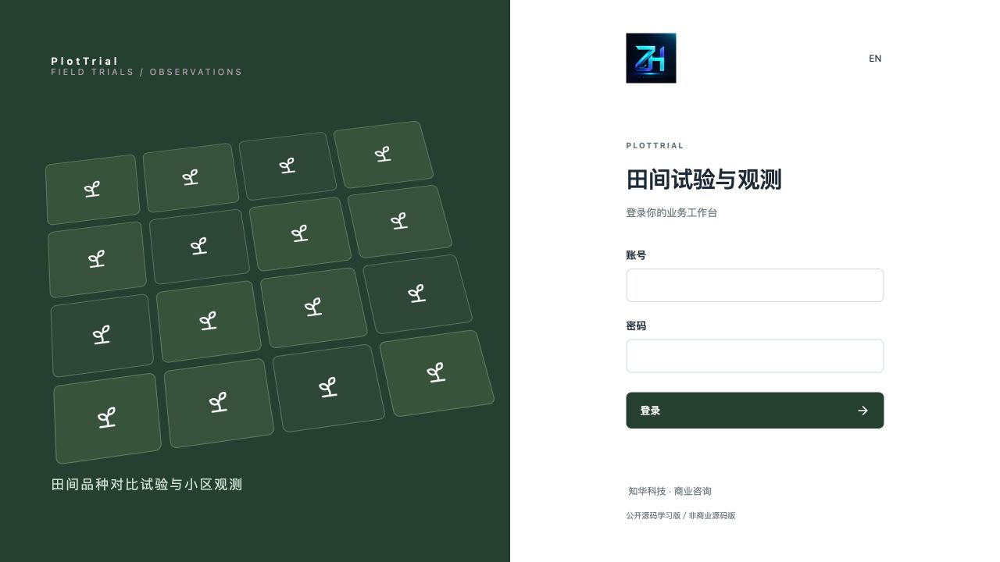

登录页面：通过会话认证进入工作空间。

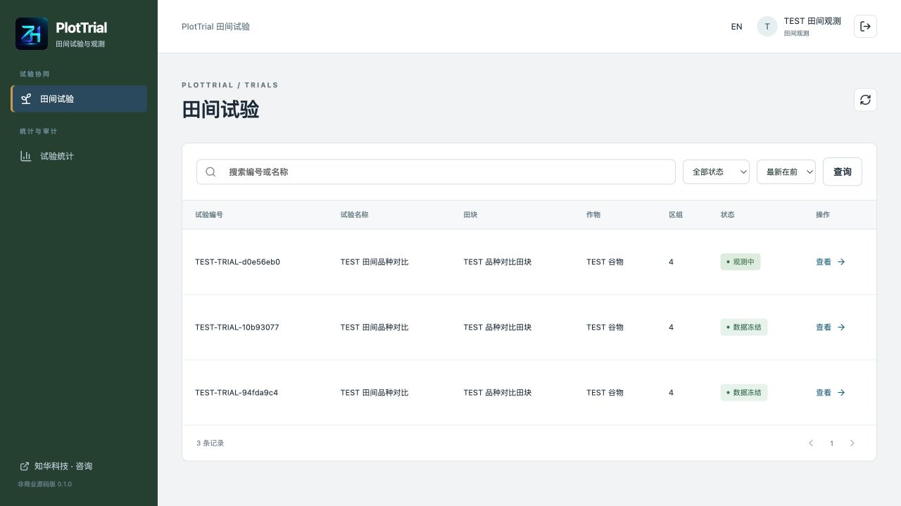

观测员工作台：查看本人被指派的试验与小区。

**方案、小区与观测**

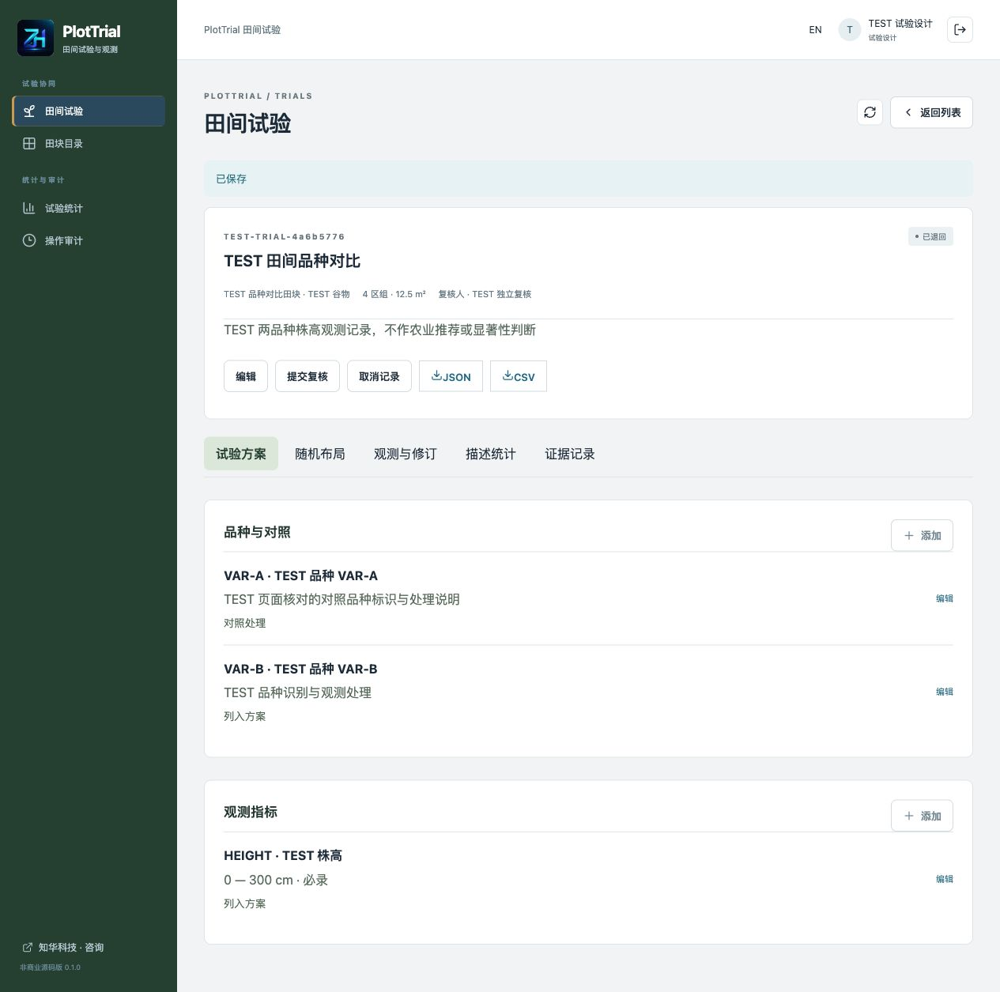

试验方案：维护品种处理、对照和数值指标。

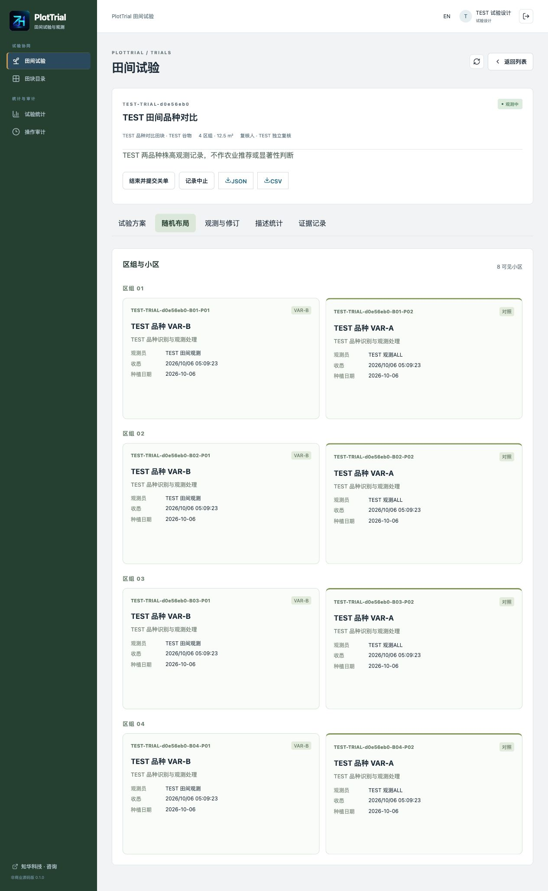

随机布局：查看冻结的完整随机区组与观测员指派。

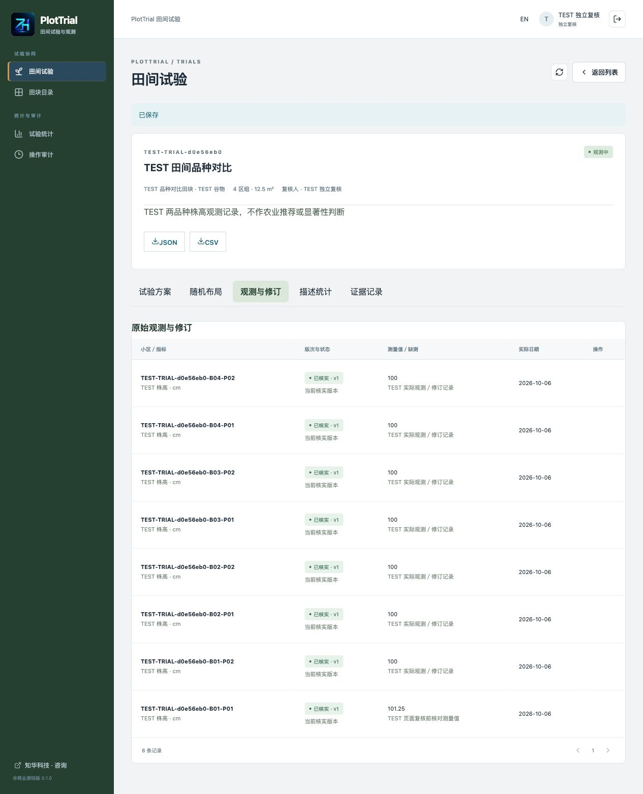

观测与修订：登记数值或缺测，追加修订并保留核实历史。

**后台、权限、统计与设置**

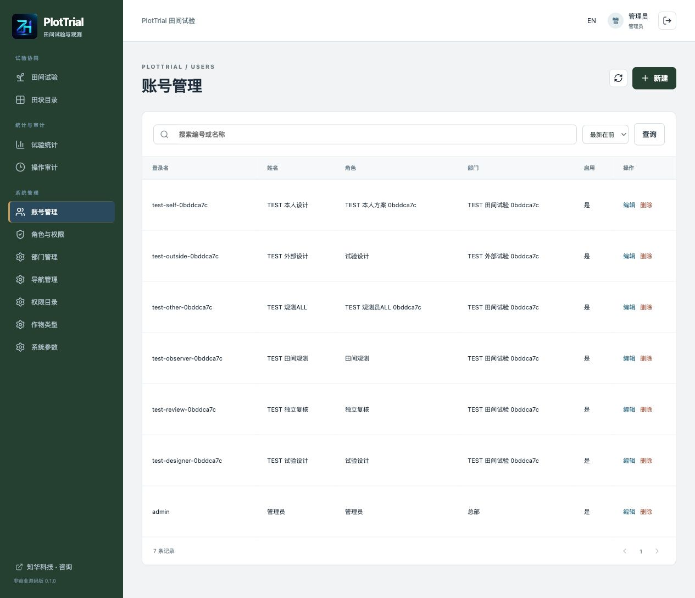

账号管理：维护账号、部门、岗位和启用状态。

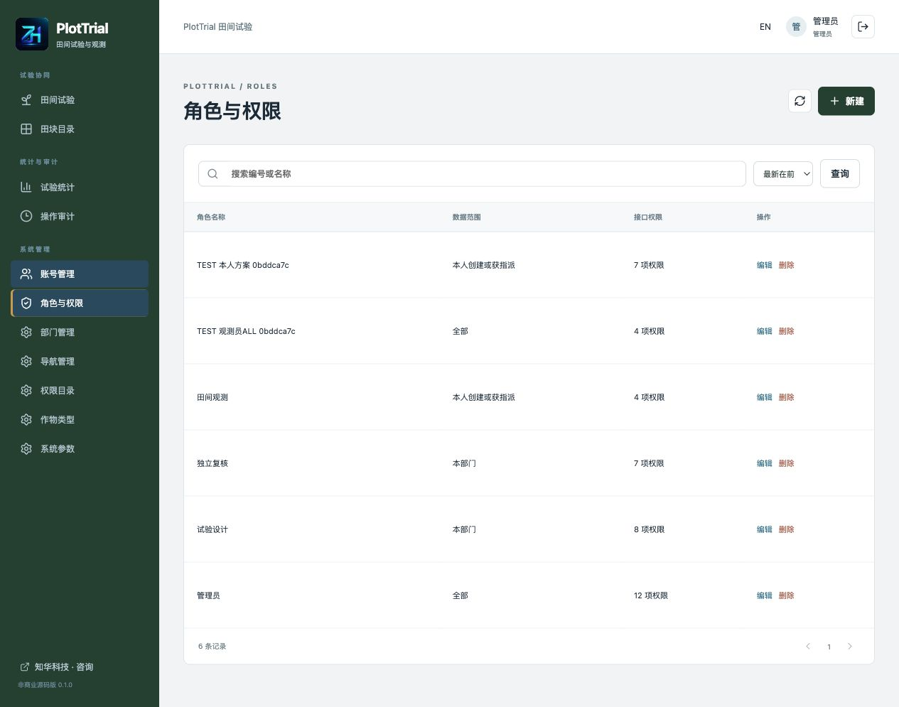

角色权限：配置接口权限与数据范围。

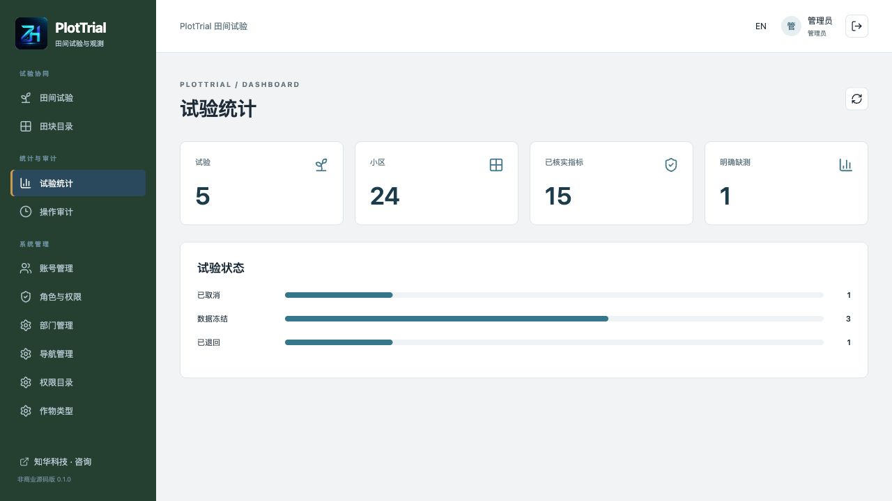

试验统计：查看授权范围内的试验进度与描述统计。

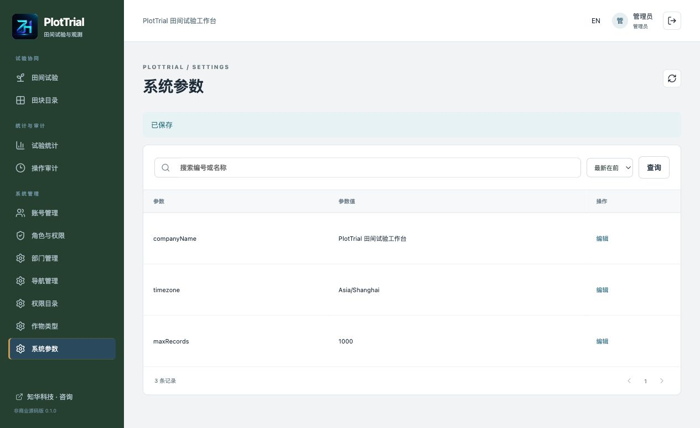

系统参数：维护工作空间名称、容量等允许调整的设置。

**英文与手机页面**

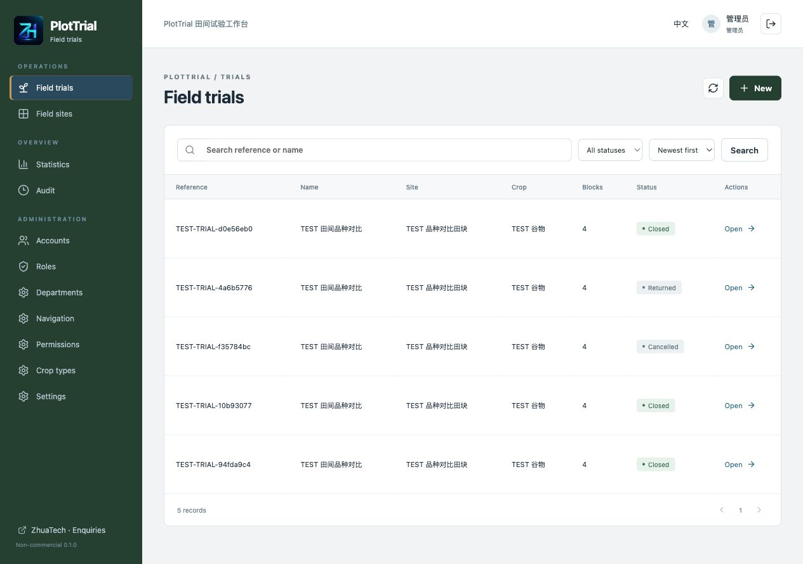

英文界面：查看英文操作页面。

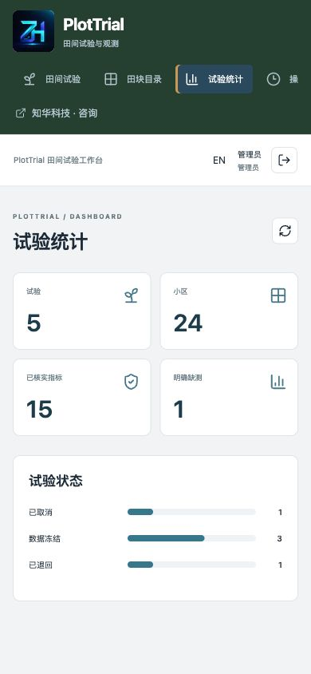

手机界面：在窄屏布局中查看和操作试验记录。

## 技术与工程

| 层次 | 版本／实现 |
| --- | --- |
| 后端 | Java 21、Maven 3.9、Spring Boot 4.0.7、Spring Security、JPA |
| 前端 | Vue 3.5.40、Vite 8.1.5、Node 24.19.0+、npm 11、Lucide 图标 |
| 数据 | MySQL 8.4、Flyway V1／V2、BCrypt 密码散列 |
| 部署 | Docker Engine 27+、Docker Compose v2、Nginx 同源代理 |
| 检查 | JUnit／MockMvc／H2、Node 测试、Spotless、ESLint、Prettier |

```text
backend/                 身份、事务、随机布局、观测与版本化迁移
frontend/                中文／英文工作台与管理员页面
scripts/init-env.py      独立本地密码生成
scripts/smoke.py         隔离环境真实 HTTP／MySQL 验收与持久化比对
scripts/release-check.py  品牌、原始二维码、图片、许可与敏感信息核查
docs/                    操作手册、架构、接口、真实截图与第三方许可
compose.yaml             三服务启动与健康检查
```

浏览器 → Nginx → Spring Boot → MySQL。数据库不映射宿主机端口；默认网页只绑定本机回环地址。所有写操作使用会话认证与 CSRF；业务写入在数据库事务内统一串行化，并检查记录版本、范围、岗位及状态。

## 首次运行：Docker Compose

准备 Docker Engine、Compose v2 和 Python 3.10+。首次构建需要访问 Maven Central、npm 和官方镜像仓库。建议可用内存 4 GB 以上。

```sh
python3 scripts/init-env.py
docker compose config --quiet
docker compose up --build -d --wait
```

访问 **[http://127.0.0.1:8130/](http://127.0.0.1:8130/)**，登录名 `admin`；密码在本机被忽略的 `.env` 的 `ADMIN_PASSWORD` 中，没有固定公开默认密码。初始化脚本拒绝覆盖已有文件，使用 0600 权限写入独立随机密码。请自行保管。

健康检查：[http://127.0.0.1:8130/actuator/health](http://127.0.0.1:8130/actuator/health)，正常响应包含`"status":"UP"`。

默认端口被占用时在 `.env` 修改 `WEB_PORT=18130`，然后重新启动本项目；不要停止其他项目。普通停止使用 `docker compose down`，保留数据库卷。**`down -v` 会删除当前 Compose 项目的数据库卷，仅限可丢弃验收环境。**

| 配置 | 含义 |
| --- | --- |
| `DATABASE_PASSWORD` | 独立数据库账号密码，必填 |
| `MYSQL_ROOT_PASSWORD` | 初始化数据库管理密码，必填 |
| `ADMIN_PASSWORD` | 仅空库初始化管理员时使用，必填 |
| `WEB_PORT` | 网页宿主机端口，默认 8130 |
| `BIND_ADDRESS` | 默认 127.0.0.1；对外部署须配置可信 HTTPS 代理和网络访问策略 |
| `COOKIE_SECURE` | 本地 HTTP 为 false，HTTPS 对外部署设 true |
| `DATABASE_URL`／`DATABASE_USER`／`DATABASE_CATALOG` | 后端直接运行可覆盖连接、账号、数据库名；Compose 使用自带 MySQL |

配置名示例在 [.env.example](.env.example)；不要提交真实配置。`ADMIN_PASSWORD` 的修改不重置已有数据库账号密码。

## 源码本地开发

先启动本项目 Compose 的 MySQL，或准备独立 MySQL 8.4 数据库。通过只在本机使用的安全连接配置设置 `DATABASE_URL`、`DATABASE_USER`、`DATABASE_PASSWORD`、`DATABASE_CATALOG` 和 `ADMIN_PASSWORD`，运行：

```sh
mvn -f backend/pom.xml spring-boot:run
```

另一个终端，在项目根目录使用 Node 24.19.0+／npm 11：

```sh
cd frontend
npm ci
npm run dev
```

开发页面 `http://127.0.0.1:5173` 将 `/api` 代理到本机 8080 后端。默认 Compose 数据库不对外暴露；宿主机开发连接可使用单独的本机测试数据库或本地自建数据库配置，不把口令写入源码。

## 数据库、初始化与升级

共 19 张表（含 Flyway 记录）：V1 管理账号、角色、角色权限、部门、权限、菜单、字典、参数和审计；V2 管理田块、试验、方案编辑人、处理、观测指标、小区、观测修订、幂等请求和业务证据。

空库只初始化一个管理员、总部、四种岗位、12 项权限、11 项菜单、四种作物类型及参数。没有虚构田块、试验或测量数据。MySQL 持久化卷保存全部业务事实；日期采用 SQL DATE，事实时刻为 UTC 微秒，页面按上海时区展示。

升级前停止业务写入并备份当前数据库及镜像版本，在独立库确认可恢复。新增迁移文件后启动新版本，由 Flyway 校验并执行；**不得修改已执行迁移或启用自动建表覆盖数据**。本版没有旧系统数据导入、自动降级或业务删除功能；回退使用匹配版本与已验证备份。备份应限制访问并保存于源码仓库之外。

## 验证方法

```sh
mvn -f backend/pom.xml spotless:check test package
cd frontend
npm ci
npm run format:check
npm run lint
npm test
npm run build
```

后端集成测试通过动态随机口令初始化隔离 H2 库，覆盖完整区组、冻结、范围、复核、缺测、修订、排除、并发、重试和 CSV；H2 不替代 MySQL 验收。Docker 后端构建执行测试，不使用跳过测试参数。

在**新建、可丢弃的验收项目和卷**启动后运行：

```sh
python3 scripts/smoke.py --allow-test-writes
python3 scripts/smoke.py --capture
python3 scripts/smoke.py --verify
python3 scripts/release-check.py
git diff --check
```

脚本只在明确启用写测试时创建 `TEST` 业务和随机测试账号，私有状态保存于被忽略的 `output/qa-state.json`（0600），不公开密码或业务响应。`--verify` 对比已保存响应；也可设置 `TEST_URL` 验证独立恢复库。截图或操作后重新 `--capture`，再执行重启与备份恢复比对。CI 检查格式、测试、前端构建和公开素材；完整 Docker 启动、业务与恢复验收须在隔离环境另行执行。

## 常见问题

- **登录失败**：确认使用首次初始化时的口令、账号启用状态及正确数据库；连续失败 8 次限制五分钟。切勿把真实密码提交到 Issue。
- **启动失败**：检查 `.env` 必填项、Docker 网络、内存、迁移及本项目服务日志。修改端口后只重建本项目服务。
- **方案无法提交**：至少两个启用处理、恰好一个对照、至少一个启用且必录指标。
- **不能批准**：必须是指定复核人，并且没有参与该方案任何编辑。管理员也不能替代指定人员。
- **不能开始**：所有小区已指派且观测员本人收悉，相关账号仍启用并具备岗位权限。
- **不能结束**：清理待处理观测与排除申请；未排除小区已种植，每项必录指标已核实。缺测可用明确原因提交核实，不能以零冒充。
- **修订被拒绝或版本冲突**：刷新记录。新增修订通过“追加修订”指向当前核实记录；不要重复创建无关联的新原始测量。
- **统计均值为空**：该处理指标尚无有效数值，缺测和排除不会填零或增加 N。

## 安全、贡献与授权

会话 Cookie 为 HttpOnly／SameSite Strict，所有写请求有 CSRF 校验；BCrypt、即时账号／角色检查、最后管理员保护、有界分页、字段白名单、乐观业务版本和 UUID 请求重试共同保护数据。CSV 对文本公式前缀转义，数值与缺测保持独立。没有多租户、HA、设备身份、电子签名、合规认证或医疗功能。对外部署须自行配置 HTTPS、可信代理、数据库备份与访问控制，详见 [SECURITY.md](SECURITY.md)。

欢迎提交可复现的 Issue 或 PR；功能范围、格式和测试要求见 [CONTRIBUTING.md](CONTRIBUTING.md)。问题反馈请附脱敏的步骤、版本及错误代码，不包含真实田块资料、密码、备份或个人数据。安全漏洞不公开提交详细利用信息，使用官网或下方商业咨询微信私下联系。

自有代码遵循 [ZhuaTech Non-Commercial Source License 1.0](LICENSE)，允许个人学习、技术研究及非商业交流，**未经书面授权不得商用**。该许可不自动授予品牌或商标权；第三方组件保留原许可，见 [THIRD_PARTY_NOTICES.md](THIRD_PARTY_NOTICES.md)。商业部署、系统集成与定制须另行书面授权。

本项目按现状提供。记录和描述统计不能保证试验设计、观测真实性或研究结论；不构成农业生产建议，也不替代专业审查。使用者负责数据、备份及适用场景评估。

## 联系知华科技

本项目由知华科技（上海如静知华信息科技有限公司）提供公开源码学习版本，主要用于个人学习、技术研究与非商业交流。未经书面授权不得商用。企业信息化建设、中小企业数字化转型、中小企业 AI 转型、私有化部署、软件外包、软件项目外包、软件实施、FDE 外包、OPC 技术支持及深度定制开发，请访问知华科技官网 <https://www.zhuatech.cn/>，或添加微信 zhuatech、zhuatech2 咨询。

| 微信 zhuatech | 微信 zhuatech2 |
| --- | --- |
|  |  |

商业授权或深度定制开发请联系知华科技。
